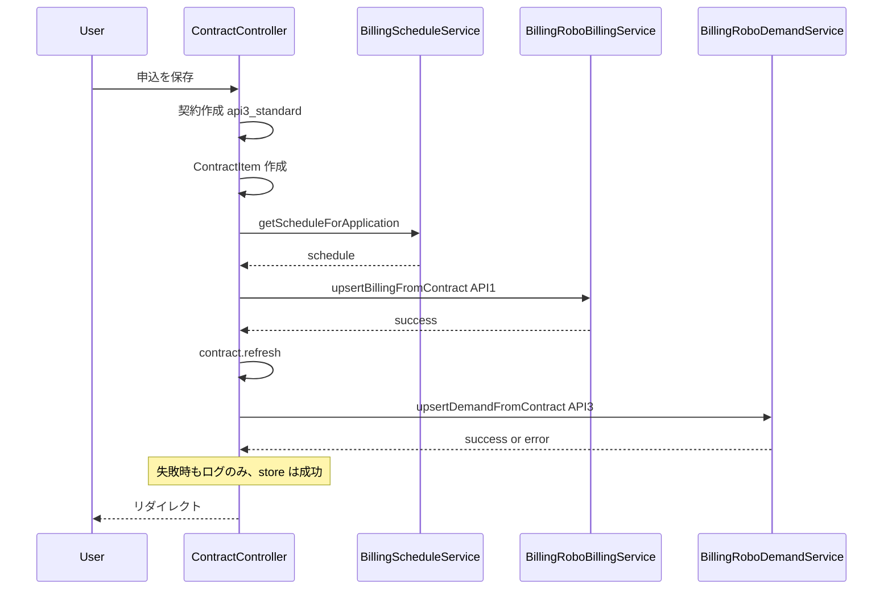

# Billing-Robo API3 標準運用モード 進捗状況

API3 標準運用モードの実装状況を一覧にした進捗ドキュメントです。実施内容・実行コマンド・テスト期待値の詳細は [implementation_report_billing_robo_2mode.md](implementation_report_billing_robo_2mode.md) を参照してください。

---

## 現状サマリ

- **API3 標準運用モードの「実行導線」は実装済み**。申込保存（`ContractController::store`）で API1 成功後に API3 を呼ぶまでコードに反映済み。
- **マイグレーション・単体テスト**: コンテナで実行済み（成功）。API2 未実行時の API3（1340）や翌月1日決済条件は**未検証**。
- **動作確認**: コンテナが Up のとき、申込フォームは http://127.0.0.1:8080/billing/ 、管理画面は http://127.0.0.1:8080/billing/admin/dashboard（要ログイン）。Nginx は `/billing/` ベースで Laravel に転送するため、URL に `/billing/` が必要です。

---

## 完了しているもの

| 項目 | 内容 |
|------|------|
| 2モード設計 | `contracts.billing_robo_mode`（api3_standard / api5_immediate）。ContractController 申込保存時は api3_standard、決済ページは api5_immediate。 |
| API1 導線 | 申込保存時に API1 をスケジュール付き（`BillingScheduleService::getScheduleForApplication`）で実行。 |
| **API3 導線** | API1 成功後、api3_standard 契約に対して `BillingRoboDemandService::upsertDemandFromContract` を実行。失敗時はログのみで store は成功のまま。 |
| 設計・報告ドキュメント | 採用案・理由、API3 追加確認、修正ファイル一覧、処理フローを [15_api3_standard_mode_completion.md](api_documents/15_api3_standard_mode_completion.md) と実施報告書に記載済み。 |
| API5 既存挙動 | 決済ページは従来どおり api5_immediate、API1→2→5。影響なし。 |

---

## 未実行（ローカルで実施が必要）／コンテナで実行済み

| 項目 | 実行コマンド | 確認観点 | 状態 |
|------|--------------|----------|------|
| マイグレーション | `docker compose exec app php artisan migrate --force` | `contracts.billing_robo_mode` が存在すること。 | **コンテナで実行済み（DONE）** |
| BillingRobo 単体テスト | `docker compose exec app ./vendor/bin/phpunit tests/Unit/Services/BillingRobo/ --testdox` | 上記 3 テストクラスがすべて成功すること。 | **コンテナで実行済み（11 件 OK）** |

---

## 未検証（仕様・結合）

| 項目 | 内容 |
|------|------|
| API2 未実行で API3 を送ったときの 1340 | 申込のみでは API2 を実行しないため、API3 が 1340 で失敗するかは未検証。失敗時はログのみで、後日「API3 再実行」導線で対応想定。 |
| 翌月1日決済の成立条件 | 請求管理ロボ側のスケジュール解釈・API2 済み前提かは未検証。 |
| API1 スケジュールの仕様優先順位 | 請求管理ロボが「請求先部署のスケジュール」を請求情報登録時にどう参照するかは公式仕様要確認。 |

---

## 必須ではないが「あった方がよい」残タスク

| 項目 | 内容 |
|------|------|
| API3 再実行導線 | API2 未実行で API3 が失敗した契約向けの、管理画面またはジョブ／Artisan コマンドでの API3 再実行。 |
| store 時の API3 呼び出しテスト | Feature/Unit で「申込保存時に api3_standard で API1 のあと API3 が呼ばれること」「API3 失敗時も store が成功すること」をモックで検証。 |

---

## 修正したファイル一覧（実装済み）

| ファイル | 変更内容 |
|----------|----------|
| app/Http/Controllers/ContractController.php | `BillingRoboDemandService` の use 追加。API1 成功後、api3_standard の場合に `upsertDemandFromContract($contract, $schedule)` を実行。成功/失敗ともログのみで store は成功のまま。 |
| AIdocs/api_documents/15_api3_standard_mode_completion.md | 新規。採用案・理由、API3 追加確認表、修正対象一覧、処理フロー。 |
| AIdocs/implementation_report_billing_robo_2mode.md | API3 導線の説明、採用方式、フロー、未検証・手動確認を追記。 |

---

## 処理フロー（API3 標準運用モード）

---

## 手動確認が必要な箇所

1. **マイグレーション**  
   ローカルで `php artisan migrate` を実行し、`billing_robo_mode` が存在することを確認。

2. **単体テスト**  
   BillingRobo 関連 3 テストクラスをローカルで実行し、すべて成功することを確認。

3. **申込のみ保存（API3 モード）**  
   「申込を保存」のみ実行し、ログに API1 完了・API3 完了（または API3 失敗の warning）が出ること。API3 成功時は `billing_robo_demands` にレコードが入ること。

4. **決済ページ（API5 モード）**  
   決済ページから申込完了まで実行し、`api5_immediate` のまま API1→2→5 が動作することを確認。
